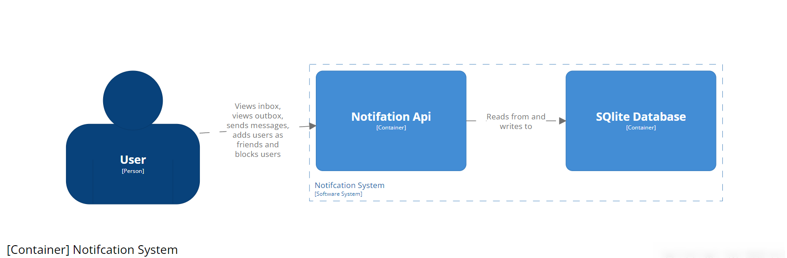
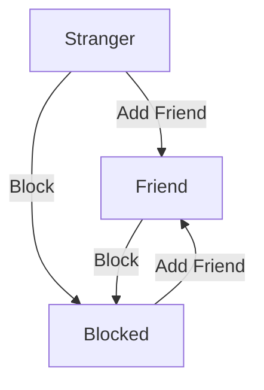
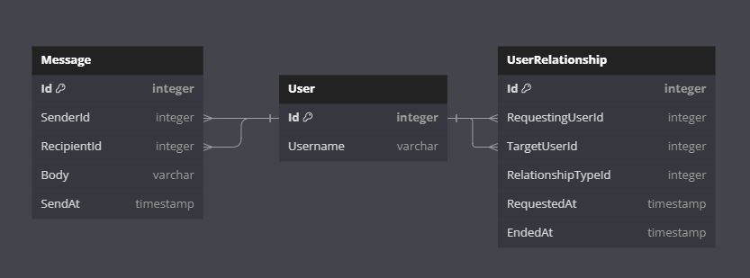

## Notification Exploration
This project is a dotnet 8 api, I am using to explore of building both a friend/block system. As well as a messaging system.

## Setup
This readme uses mermaidjs, you can install an addon in your ide to render the diagram.

The api will generate a SqLite database, which is used as the db for the api.
If you want a fresh database you can delete the SqLite file which is generated in the root folder.
When running the API again the file will be regenerated.

## Overall Architecture

The Notification Exploration project has an Api, a Domain Layer and a Data Layer
It uses Minimal api, structuring the endpoints in a grouping, this grouping is followed in both the Domain and Data layer.
Current groups are:
- Messages
- Users

The intention is that if the api needed to be split the grouping could be used to make the split.
This would allow scaling at a smaller level. If for example the User part of the Notification api is getting higher traffic the user api could be split off as it's own separate api which could be scaled to the traffic. 

This grouping also sets up a pattern for future features. More groups could be added to support additional features. The grouping also helps developers have a common way through the project, they can expect each layer to follow the same grouping and can easily navigate through the code.

### Test setup
The solution has an integration test project and a domain test project. The integration test project can be used to build regression tests for the api. The domain test project can be used to create unit tests for the domain layer.

## User Relationship Flow

In the Notification API there is a user relationship system that dictates how users can interact with each other. Below is an overview of the various states and transitions within the user relationship flow:

### Stranger
- By default, any user outside of one's personal network is categorized as a *Stranger*. This is the starting state for any two users who have not interacted.
     - strangers cannot send messages to each other
  
### Friend
- A user can become a friend, by simply adding that user as a friend
  - Once a user is friend, you can send messages to them 

### Block
- Any user can choose to block another user, whether they are a *Stranger* or a *Friend*. This changes the state to *Blocked*. 
  - Blocked users will be treated as not existing. The api will return not found when the blocked user tries to interact with the user who requested the block.

### Blocked
- The *Blocked* state represents a scenario where one user has limited another's access to send them messages. The blocked party cannot send friend requests or interact in ways that are otherwise allowed between users in different states.

## Database design

The Notification Api has this database schema:

Users can have relationships to other users. Currently only two types of relationships:
- Block
- Friend

The database used is an SqLite database. If this project was to be used in production it would need a different technology for the database. I abstracted it in a way were we would only need to redo the data project in the solution. The intefaces in the domain layer would just need to be met in the new data project.